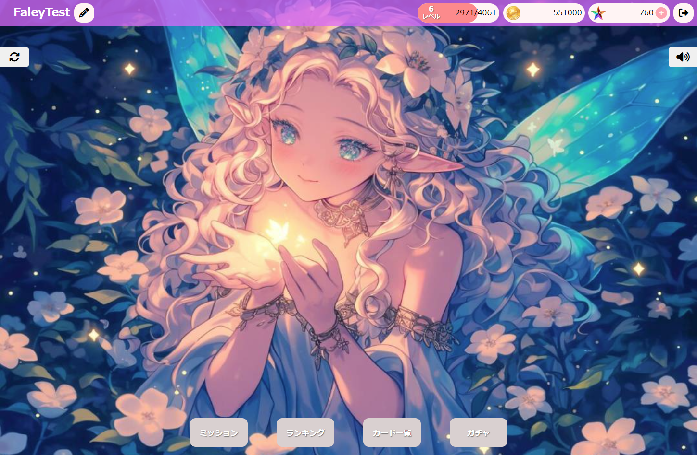

# ps_game
ガチャシステムのブラウザゲームです。 
🖼 画像はAI無料ソースを使用しています。 
🎶 ページに流れる音楽のソースは[こちら](https://pixabay.com/music/search/genre/video%20games/)です。

## ゲームスタート
🎮 こちらからゲームのログインできます：[ゲームリンク](http://153.126.183.193/student/k248010/ps_game/)
 ログインできるテスト用のメールとパスワード：
 test@mail.com
 forTest123

## 使い方
ダウンロードと設定が出来ましたら、登録ページにユーザーを登録し、ログインしてから、作成が完成したら、ホームページに行きます。ここからゲームシステムが始まっています。

## システム紹介
ここからはシステム画像を紹介します。 
**⊛現状、ゲームの一部が開発中です。**　 
出来上がり分：ログイン、登録、ホームページ（ユーザーUI＋ネーム変更＋ホームキャラ）、ショップ、ガチャ、カード一覧　 
開発中：ゲームページ、ミッション　 

### ホームページ

#### ホームページのカード選択

### ショップ
#### 有償ジェムの購入

#### パックの購入

### ガチャ
#### ガチャ選択

#### 有償ジェムのガチャ

#### ガチャを回した結果（10回分）

#### ガチャに合わせてカードリスト

#### ユーザーが回したガチャ履歴

### カード一覧

#### カード一覧のカード情報

### ランキング

